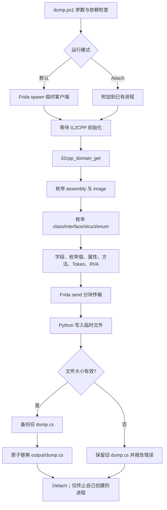

# Dumper 流程图 / Dumper flowchart

```mermaid
flowchart TD
    ps1["dump.ps1 参数与依赖检查"] --> mode{"运行模式"}
    mode -- 默认 --> spawn["Frida spawn 临时客户端"]
    mode -- Attach --> attach["附加到已有进程"]
    spawn --> init["等待 IL2CPP 初始化"]
    attach --> init
    init --> domain["il2cpp_domain_get"]
    domain --> assemblies["枚举 assembly 与 image"]
    assemblies --> classes["枚举 class/interface/struct/enum"]
    classes --> members["字段、枚举值、属性、方法、Token、RVA"]
    members --> chunks["Frida send 分块传输"]
    chunks --> tempfile["Python 写入临时文件"]
    tempfile --> verify{"文件大小有效?"}
    verify -- 否 --> fail["保留旧 dump.cs 并报告错误"]
    verify -- 是 --> backup["备份旧 dump.cs"]
    backup --> atomic["原子替换 output/dump.cs"]
    atomic --> cleanup["Detach；仅终止自己创建的进程"]
    fail --> cleanup
```

该流程不修改客户端二进制文件，默认不访问远程服务。

The workflow does not modify client binaries and does not contact remote
services by default.
